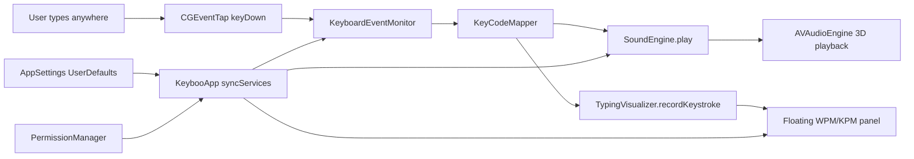

# Keyboo — Full App Context Brief

> Paste this into another AI chat to brainstorm product, features, distribution, or technical direction.

## One-liner

**Keyboo** is a native **macOS menu bar app** that plays **mechanical keyboard sound effects** whenever you type **anywhere on the system** — like having thocky/clicky switches on a silent laptop keyboard.

---

## What it does (user-facing)

| Feature | Status |
|--------|--------|
| Global typing sounds | ✅ Works |
| 11 switch sound profiles | ✅ Bundled |
| 3D spatial audio (position mapped to key) | ✅ Works |
| Menu bar control UI | ✅ Works |
| Floating WPM/KPM typing HUD | ✅ Works (optional) |
| Permission onboarding window | ✅ Works |
| Settings window (`⌘,`) | ✅ Works |
| Launch at Login | ⏳ UI exists, **disabled / “Coming soon”** |
| Volume control | ❌ **Not implemented** (README mentions it, code doesn’t) |
| Dock icon | ❌ Hidden (`LSUIElement`) — menu bar only |

---

## Tech stack

- **Language:** Swift
- **UI:** SwiftUI + AppKit (`MenuBarExtra`, `NSPanel`, `Settings` scene)
- **Audio:** AVFoundation (`AVAudioEngine`, `AVAudioEnvironmentNode`, 3D spatial)
- **Input:** CoreGraphics `CGEventTap` (listen-only, keyDown only)
- **Persistence:** `UserDefaults` via `AppSettings`
- **Target:** macOS **26.3**
- **Bundle ID:** `com.Keyboo`
- **No network, no analytics, no cloud**

---

## Architecture (data flow)



### Core singletons

| Component | Role |
|-----------|------|
| `AppSettings` | Enabled state, profile, visualizer, position, onboarding flag |
| `PermissionManager` | Input Monitoring permission check/request/polling |
| `KeyboardEventMonitor` | Dedicated thread + run loop for CGEventTap |
| `SoundEngine` | Preloads WAV buffers, round-robin playback, spatial positioning |
| `TypingVisualizer` | Floating `NSPanel` with WPM/KPM overlay |
| `KeyCodeMapper` | keyCode → sound category + 3D position + speed counting |

---

## Privacy model

- Reads **only virtual key codes** from `keyDown` events
- **Never** reads typed characters, clipboard, or key combos for text capture
- **Never** stores or logs keystrokes
- Requires **Input Monitoring** (not Accessibility — app detects common mix-up)
- `NSListenEventUsageDescription` in Info.plist explains this to the user

Strong differentiator vs. keyloggers. Anything needing actual typed text is off-limits unless redesigned.

---

## Sound system

### 11 profiles (`SoundProfileID`)

Grouped by brand in the menu:

| Brand | Profiles |
|-------|----------|
| Keychron | Default (Gateron Red), Thock (Gateron Brown) |
| Cherry | MX Blue, Speed Silver |
| Kailh | Box Jade |
| Durock | Clicky (Alpaca) |
| C³Equalz | Holy Panda |
| NovelKeys | Typewriter (Cream) |
| Topre | Topre Purple Hybrid |
| Akko | Lavender Purple |
| Everglide | Oreo |

Each profile has **6 sound categories**:

- `normal` — 2 variants (`key_01`, `key_02`) for randomization
- `space`, `enter`, `backspace`, `modifier` — 1 each

### Audio engine details

- Samples preloaded into `AVAudioPCMBuffer` at launch / profile switch
- **4 player nodes per sample** for polyphony (rapid typing)
- **Round-robin** selection across samples and player nodes
- **3D spatial:** each key maps to X/Y/Z on a virtual keyboard; listener at origin
- Reverb enabled at 10% blend
- `.auto` rendering (HRTF on headphones, virtual surround on speakers)
- **Requires mono WAV files**

### Asset layout

```
Keyboo/Resources/Sounds/{profile}/{profile}_{category}_01.wav
```

Loader tries subfolder paths first, then flat prefixed names (Xcode may flatten bundles).

---

## Keyboard mapping (`KeyCodeMapper`)

- **Categories:** normal, space, enter, backspace, modifier
- **Spatial:** US QWERTY layout assumed — pan X by column, Y by row (top/home/bottom)
- **Speed counting:** only `normal` + `space` keys count toward WPM/KPM
- **WPM formula:** `KPM / 5` over a rolling **10-second window** (min 0.5s elapsed)

---

## UI surfaces

### 1. Menu bar (`MenuBarExtra` → `MenuBarView`)

- Enable/disable toggle (gated on permission)
- **Switch** submenu — brand-grouped picker with color swatch icons
- **Visualizer** submenu — toggle + left/center/right position
- Settings link, Quit

### 2. Permission onboarding (`PermissionOnboardingView`)

- Shown on first launch until completed or skipped
- Step-by-step Input Monitoring guide
- Auto-dismisses when permission granted

### 3. Settings (`SettingsView`, `⌘,`)

- Launch at Login (disabled placeholder)
- Permission status + open System Settings
- Privacy copy

### 4. Typing visualizer

- Borderless floating `NSPanel` at bottom of screen
- Shows WPM + KPM in a dark capsule
- Accent color matches selected switch swatch
- Ignores mouse events, visible on all spaces

---

## App lifecycle & edge cases

- **`LSUIElement = YES`** — no Dock icon; menu bar only
- **Single instance:** Release builds activate existing instance and quit duplicate; Debug builds force-terminate old Xcode runs
- **Permission polling:** Menu bar apps rarely become “active”, so `PermissionManager` polls every 1s until granted
- **Event tap thread:** Separate `Keyboo.EventTap` thread with its own run loop; sound plays directly from callback for low latency; visualizer updates dispatched to main actor

---

## User settings (`UserDefaults` keys)

| Key | Default |
|-----|---------|
| `isEnabled` | `true` |
| `selectedProfile` | `default` |
| `launchAtLogin` | `false` (not wired up) |
| `enableVisualizer` | `false` |
| `menuBarPosition` | `center` |
| `hasCompletedPermissionOnboarding` | `false` |

---

## File map

```
Keyboo/
  KeybooApp.swift              Entry, MenuBarExtra, service orchestration
  AppDelegate.swift            Single-instance enforcement
  MenuBarView.swift            Menu bar UI
  SwitchSwatchView.swift       Switch color swatch icons for menu
  SettingsView.swift           Settings window
  PermissionOnboardingView.swift  First-run onboarding
  PermissionManager.swift      Input Monitoring permission
  PermissionXcodeDevNote.swift   Dev note for Xcode permission quirks
  KeyboardEventMonitor.swift   CGEventTap listener (dedicated thread)
  SoundEngine.swift            AVAudioEngine spatial playback
  SoundProfile.swift           Profile enum + asset resolution
  KeyCodeMapper.swift          Key code → category, 3D position, speed
  TypingVisualizer.swift       Floating HUD panel controller
  TypingVisualizerView.swift   WPM/KPM overlay UI
  AppSettings.swift            UserDefaults state
  Info.plist                   NSListenEventUsageDescription
  Resources/Sounds/            66 WAV files across 11 profiles
  Assets.xcassets/             App icon + menu bar icon (light/dark)
```

---

## Known gaps / README drift

1. **Volume control** — README mentions “Sound volume submenu”; not in code
2. **Launch at Login** — toggle exists but is disabled with “Coming soon”
3. **README lists 4 profiles** — code has **11**
4. **Keyboard layout** — spatial mapping assumes US QWERTY only
5. **No keyUp sounds** — only keyDown
6. **No per-app profiles** — one global profile at a time
7. **No custom profile import** — hardcoded enum + bundled assets
8. **No App Store / notarization / Sparkle update** setup visible yet

---

## Comparable apps / market context

- **Mechvibes, Clickey, Klack** — similar “fake mechanical keyboard sounds” space
- Keyboo’s angles: native macOS, spatial 3D audio, switch-brand theming, privacy-first (keyCode only), typing speed HUD

---

## Brainstorm prompts

### Product

- Should Keyboo be free, one-time purchase, or subscription?
- Is “switch collector” branding (11 real switch names) the right vibe vs. generic “Thock / Clicky / Linear”?
- Menu bar-only vs. optional mini preview window?

### Features (high impact, fits architecture)

- Volume slider + per-category volume (modifier quieter?)
- Launch at Login (`ServiceManagement` / `SMAppService`)
- Key-up release sounds
- Profile preview in menu (tap to hear sample)
- Non-QWERTY layout support
- Per-app sound profiles (needs app focus detection — no text capture)
- Streak / session stats in visualizer
- “Quiet hours” schedule
- Reduced motion / simpler audio mode

### Features (harder / tradeoffs)

- Custom user sound packs (file picker + sandbox)
- Recording your own keyboard
- iOS / iPad companion (different permission model)
- Sync settings via iCloud

### Technical

- Reduce latency further (pre-warm engine, avoid lock in hot path)
- Dynamic profile loading from folder (drop-in packs)
- Unit tests for KeyCodeMapper and speed calculation
- Accessibility: VoiceOver labels, reduced audio

### Distribution

- Mac App Store vs. direct download (Input Monitoring is sensitive for review)
- Notarization + hardened runtime
- Website / landing page copy emphasizing privacy

### Monetization / growth

- Free core + paid switch packs
- Affiliate links to real switch vendors
- “Typewriter mode” as premium
- Share WPM screenshots (social hook)

---

## Elevator pitch

> Keyboo is a privacy-respecting macOS menu bar utility that makes any keyboard sound like a mechanical one. It listens globally for key codes (never typed text), plays low-latency 3D-spatial switch sounds from 11 themed profiles, and optionally shows a floating WPM/KPM HUD. Built in Swift with CGEventTap + AVAudioEngine. No network. Menu bar only. Requires Input Monitoring permission.

---

## Short system prompt (for AI chats)

```
You are brainstorming for Keyboo, a native macOS menu bar app that plays mechanical keyboard sounds on every keypress system-wide. It uses CGEventTap (keyCode only, never typed text), AVAudioEngine with 3D spatial audio, 11 switch-themed sound profiles, and an optional WPM/KPM floating HUD. No network, no analytics. Built in Swift/SwiftUI. Gaps: no volume control, launch-at-login not wired, US QWERTY only, no custom packs. Help me think through [YOUR TOPIC].
```
